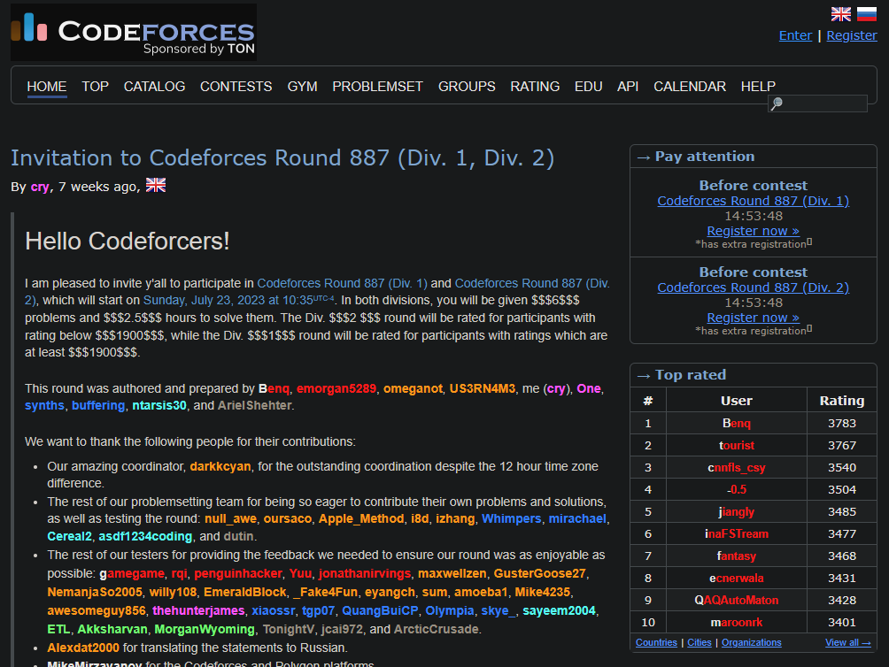
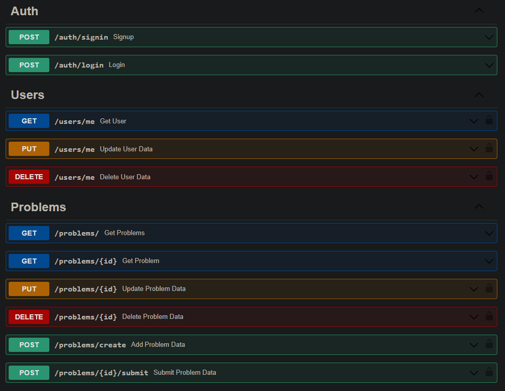

# Codeforces Clone Project - Backend


## Tech

- Python
- FastAPI
- MongoDB (with Motor.py)
- Docker (currently not tested)


## What its [Codeforces](https://codeforces.com/)

Codeforces is a website that hosts competitive programming contests. It is maintained by a group of competitive programmers from ITMO University led by Mikhail Mirzayanov. It is one of the best platforms for competitive coding and is usually known for its short challenges/contests where programmers from every corner of the world participate. You can practice problems from very beginner level to very advanced level.

CODEFORCES OFFICIAL WEBPAGE


## Features 


Auth throuth OAuth2 Scheme and JWT Tokens
- [x] SignIn
- [x] LogIn


- [x] Store Users in the DB
    - [x] update users info
    - [x] delete user with matching ID

- [x] Create Problems and save them in DB
    - [x] only authenticated users can create problems
    - [x] update problem info
    - [x] delete problem with matching ID

- [ ] Submit a problem answer
- [ ] judge the answer feature


## Get Started

### Requirements

- python
- pip


### Steps
```sh
# get the repo
git clone https://github.com/rivasjoaquin02/codeforces-clone-backend.git

# Install pip dependencies
pip install -r /api/requirements.txt

# run it
python /api/main.py
```

## Docs with Swagger UI

- [Docs](http://localhost:8000/docs)

